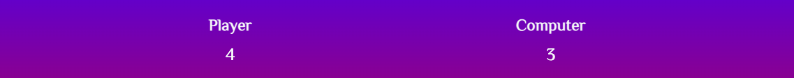
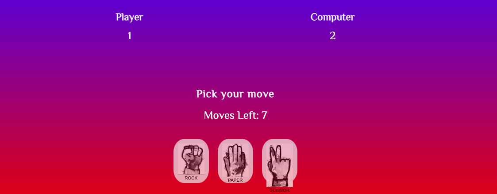

# Rock Paper Scissors

Play the classic game rock scissors and bag. A game that most people know all over the world. You play together with the computer to get the highest score after 10 moves
<p>&nbsp;</p>


# Table of Contents
1. [Ux](#id-ux)
2. [Features](#id-features)
    * [Header and Title](#id-header)
    * [Instructions](#id-instructions)
    * [Scores](#id-scores)
    * [Game area](#id-game-area)
    * [Game](#id-game)
    * [Result](#id-result)
    * [Win box](#id-win)
    * [Lose box](#id-lose)
    * [Restart button](#id-restart)
3. [Testing](#id-testing) 
4. [Validator Testing](#id-validator)
5. [Bugs](#id-bugs)
6. [Unfixed Bugs](#id-bugs)
7. [Technologies used](#id-tech)
8. [Deployment](#id-deploy)
9. [Credits](#id-credits)
10. [Acknowledgements](#id-acknowledgements)


# Ux<div id='id-ux'>

## User Stories

* As a User

  * As a user, I want a website that is easy to understand.
  * As a user, I want to see an interactive game that will that will show who wins each move.
  * As a user, I want to see a game that will be playable on all devices and performace and experience will not change.
  * As a user, I want to see how many moves that are left each move, to increase the excitement as the score counts down.
  * As a user, I want to see who wins each round.
  * As a user, I want to easily see how I can play the game again.<p>&nbsp;</p>  

* As a returning user 

  * As a returning user, I want the website to be continually updated with new features to keep me coming back and playing the game.


# Features<div id='id-features'>
* ## The Header and Title<div id='id-header'>
When the user opens the webpage, the website color is the first thing that will catch their attention. It's colorful and feels like a fun game! The headline that says "let's play" hopefully makes the player feel welcome and can't wait to face the computer in an exciting match.<p>&nbsp;</p>   
 

* ## Scores<div id='id-scores'>
This area is where the computer and users scores are displayed. to win the game it's about getting the highest score after 10 moves.
<p>&nbsp;</p>


* ## Game area<div id='game-area'>
The game area is the area where you see the entire game. There is a text to show where you pick your move to easily see how you start playing. It also shows how many moves that are left before the round ends. After each choise you make, a text is shown how each move went and after 10 rounds you see who wins the game. When the game is finished, it shows who won and to easily play the game again, a restart button is shown<p>&nbsp;</p>


* ## Game<div id='id-game'> 
The game is where the player challenges the computer. There are three choices for both to make, rock, paper or scissors. The player starts to choose, then it's the computer's turn, which is completely random. Below the buttons it's shown who is beating the other in each round while the score increases for each participant after each move.<p>&nbsp;</p>
 

* ## Result<div id='id-result'>
Each time the user and computer make a choice, a message will appear below the game. The message will let the user know who wins each move. When ten rounds have passed, when ten rounds have passed the player is told if they have won or lost the game.<p>&nbsp;</p>
 

* ## Winning Text<div id='id-win'>
The user who defeats the computer is notified by a text that they have won the game. This is when the game is over after ten rounds and the user can restart the game again. This is good for the user, as they are informed that the game is over and will not continue.<p>&nbsp;</p>


* ## Losing Text<div id='id-lose'>
When the computer wins the users are notified with a text that they have lost the game. This is when the game is over after ten rounds and the user can restart the game again. This is good for the user, as they are informed that they have lost and the game will not continue.<p>&nbsp;</p>


* ## Restart button<div id='id-restart'>
When the game is over, a button appears where the player can choose to restart the game. The game is restarted when the button is clicked and the score and remaining moves are reset.<p>&nbsp;</p>
 


* ### Features Left to Implement
 * I would like to add the player's as well as the computer's choice of rock, paper or scissors, not just who wins.
 * Presently, the user is notified by text of the website's computer selection. I would like to implement a feature that highlights the computers' choice with a colored background, while also communicating the result with the text below.


# Testing<div id='id-testing'>

* Search Engines
  * I tested my website on Google Chrome, Safari and Mozilla Firefox. The website appeared as I had intended it to  and performed well on those search engines. I did not encounter bugs or experience any issues.
* Amiresponsive
  * To test my website on all iphone devices I used [am i responsiveness](http://ami.responsivedesign.is/). I added a screenshot of how these look on the top of the Read.me.
  
  
### Tests were performed on the following devices to ensure their responsiveness and to ensure that all the features worked correctly and that there were no unresolved bugs.

* Mobile Phones/Tablet
   * Samsung Galaxy A50

   * Iphone 12
   
   * Apple Ipad.

* Desktop/Laptop
   * Apple Macbook

   * Apple Imac

   * ASUS Chromebook Flip C434


# Validator Testing<div id='id-validator'>

  * Lighthouse
    *  I tested he website on the Lighthouse testing in the chrome dev tools and the results are shown below.  

    


  * Html
    *  There were no errors found when I tested the webpage on the HTML validator.   
        
  

  * CSS
    *  There were no errors found when I tested the webpage on the CSS validator.  
            


  * javaScript
    *  There were no errors found when I tested the webpage on jshint.   
            

# Bugs<div id='id-bugs'>
   * There was only one problem I encountered while developing this website, and it was not an issue with the website itself. When I first tried to use jshint, I was getting a lot of errors which read "'const' is available in ES6 (use 'esversion: 6') or Mozilla JS extensions (use moz)." I had no idea what they were about. I Googled it and was unable to find an answer.
   * As a result, I went to Slack see if anyone else had this same issue. Someone was able to help. They explained that I would need to add /*jshint esversion: 6 */ at the top of the page, and then all these errors would be solved.

## Unfixed Bugs<div id='id-unfixed'>
   * There was an issue with the restart button when testing the website on an Iphone pro 12. The text in the button spilled over to the bottom border of the button. I tried adding padding to the button which improved the aesthetic of the button on most devices, but did not resolve the problem on the Iphone 12.  

# Technologies Used<div id='id-tech'>
 * HTML5
 * CSS3 
 * javaScript
 * Gitpod 
 * GitHub 
 * Google Fonts
 * shutterstock
 * Chrome dev tools

# Deployment<div id='id-deploy'>


* Create the repository for the website you wish to publish.
* The next step is to push code.
* Then go to the settings.
* Scroll down to Github pages and click on the link.
* Then at the source there is a drop down icon click on this and select main branch.
* The page will refresh with a link to the website. Once the link is selected then website is deployed.

The live link to this website can be found here - https://squirkey89.github.io/Rock-Paper-Scissor-portfolio-project/
 

# Credits<div id='id-credits'>
  * I used [am i responsiveness](http://ami.responsivedesign.is/) web site for checking responsiveness on all Apple devices screen sizes.
  * When coding the project I referenced the [love maths project](hhttps://github.com/Code-Institute-Solutions/love-maths-2.0-sourcecode) The code referenced ```let userScoreDisplayed = parseInt(document.getElementById("user-score").innerText); document.getElementById("user-score").innerText = ++userScoreDisplayed;```.
  * Code was referenced from Dani Krossing's [YouTube channel](https://www.youtube.com/watch?v=kEf1xSwX5D8) when creating this website's Favicon.
  Here is the code:```link rel="shortcut icon" href="assets/images/android-chrome-192x192.png"```.
  * I also referenced code from whatsdev [YouTube channel](https://www.youtube.com/watch?v=Qqy8Ov3NWvQ) The code referenced is ```function generateComputerChoice() {
	let choices = ['rock', 'paper', 'scissors'];
	let randomNumber = Math.floor(Math.random() * choices.length);
	return choices[randomNumber];```.


**Media**
  * All the images used in the website were taken from [shutterstock](.https://www.shutterstock.com/).
  * The icon used for the websites favicon was created and downloaded from [Favicon Generator](https://favicon.io/).
  * The emojis that I used in the game were taken from [getemoji](https://getemoji.com/).

# Acknowledgments<div id='id-acknowledgements'>
   * My mentor for the useful feedback direction and guidance.
   * The online tutors and the slack community for help and and advice.
   * Code Institite course material.
