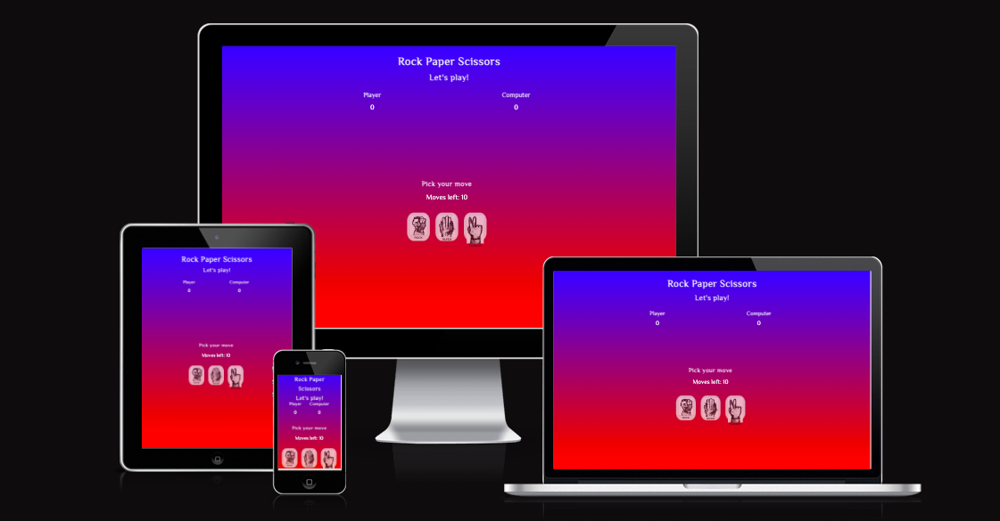
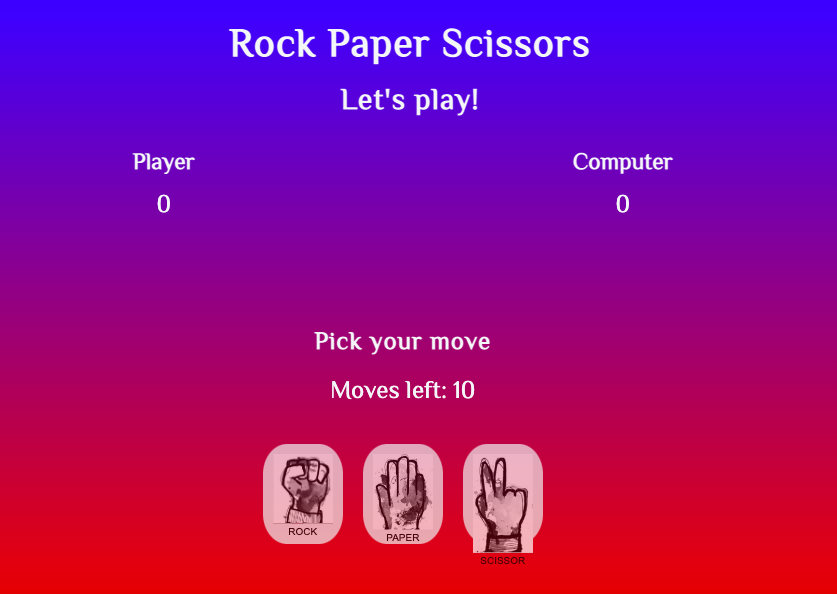
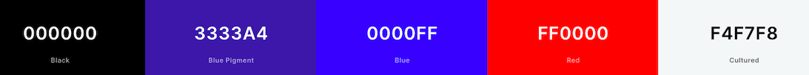
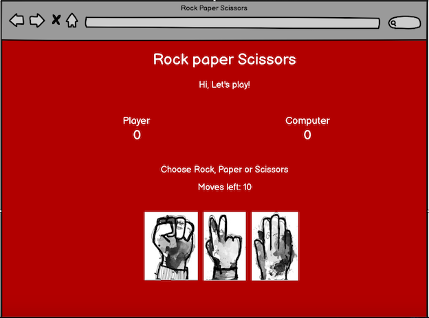
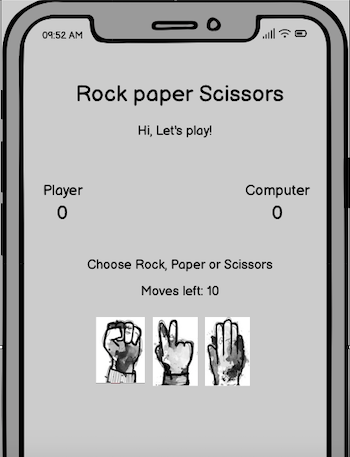
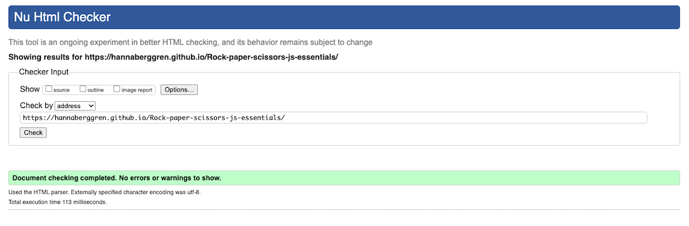
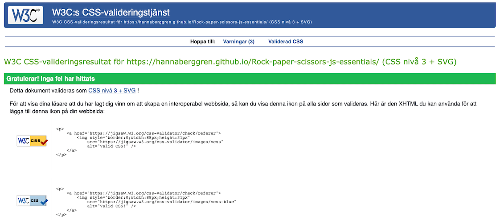
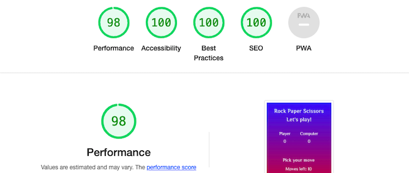

# Rock Paper Scissors

Play the classic game rock scissors and bag. A game that most people know all over the world. This website was designed and developed as a simple game that can be enjoyed by people of all ages. You play together with the computer to get the highest score after 10 moves.


# Table of Contents
1. [Ux](#id-ux)
2. [Features](#id-features)
    * [Header and Title](#id-header)
    * [Scores](#id-scores)
    * [Game area](#id-game-area)
    * [Game](#id-game)
    * [Winning text](#id-win)
    * [Losing text](#id-lose)
    * [Restart button](#id-restart)
3. [Design](#id-design)
4. [Technologies used](#id-tech)
5. [Testing](#id-testing) 
6. [Validator Testing](#id-validator)
7. [Bugs](#id-bugs)
8. [Unfixed Bugs](#id-unfixed)
9. [Deployment](#id-deploy)
10. [Credits](#id-credits)
11. [Acknowledgements](#id-acknowledgements)


# Ux<div id='id-ux'>

## User Stories

* As a User

  * As a user, I want a website that is easy to understand.
  * As a user, I want to see an interactive game that will show who wins each move.
  * As a user, I want to see a game that will be playable on all devices and performace and experience will not change.
  * As a user, I want to see how many moves that are left each move, to increase the excitement as the score counts down.
  * As a user, I want to see who wins each round.
  * As a user, I want to easily see how I can play the game again. 

* As a returning user 

  * As a returning user, I want the website to be continually updated with new features to keep me coming back and play the game.


# Features<div id='id-features'>
* ### The Header and Title<div id='id-header'>
When the user opens the webpage, the website color is the first thing that will catch their attention. It's colorful and feels like a fun game! The headline that says "Let's play" hopefully makes the player feel welcome and can't wait to face the computer in an exciting match.


* ### Scores<div id='id-scores'>
This area is where the computer and users scores are displayed. To win the game it's about getting the highest score after 10 moves.


* ### Game area<div id='id-game-area'>
The game area is the area where you see the entire game. There is a text to show where you pick your move to easily see how you start playing. It also shows how many moves that are left before the round ends. After each choise you make, a text is shown how each move went and after 10 rounds you see who wins the game. When the game is finished a text shows who won and a restart button appears to easily play the game again.



* ### Game<div id='id-game'> 
The game is where the player challenges the computer. There are three choices for both to make, rock, paper or scissors. The player starts to choose, then it's the computer's turn, which is completely random. Below the buttons it's shown who is beating the other in each round while the score increases for each participant after each move.


* ### Winning Text<div id='id-win'>
The user who defeats the computer is notified by a text that they have won the game. This is when the game is over after ten rounds and the user can restart the game again. This is good for the user, as they are informed that the game is over and will not continue.


* ### Losing Text<div id='id-lose'>
When the computer wins the users are notified with a text that they have lost the game. This is when the game is over after ten rounds and the user can restart the game again. This is good for the user, as they are informed that they have lost and the game will not continue.


* ### Restart button<div id='id-restart'>
When the game is over, a button appears where the player can choose to restart the game. The game is restarted when the button is clicked and the score and remaining moves are reset.


* ### Features left to implement
 I would like to implement a featue what the player's as well as the computer's choice of rock, paper or scissors are, not just who wins. I also would work on my media queries to get the game to look better on bigger screens.

# Design<div id='id-design'>
* ### Colours
I used linear-gradient from blue to red to get the to get viewers' attention. I been trying to get good visibility using the contrast of the different colors so that the visually impaired can easily see everything that is written.
I have also tried to make my page look happy by mixing the colors from my palette in a tasteful way.
   
* ### Colour Palette


* ### Wireframes
Wireframes were created for mobile and desktop.
To get an overview of how the page will look when it is finished.
 


* ### Media
  * All the images used in the website were taken from [google](https://www.google.com/search?q=rock+paper+scissors&sxsrf=ALiCzsabE9Ik_YUzB1yvSEKGdOahmuxWIA:1670439827741&source=lnms&tbm=isch&sa=X&ved=2ahUKEwix8LOkmej7AhX9avEDHfACAs8Q_AUoAXoECB8QAw&biw=1440&bih=703&dpr=1).

* ### Typography

  * The font chosen was El Messiri, Arial for the whole page.
  

# Technologies Used<div id='id-tech'>
 * HTML5
 * CSS3 
 * javaScript
 * Gitpod 
 * GitHub 
 * Google Fonts
 * Chrome dev tools

# Testing<div id='id-testing'>

* ### Validator Testing<div id='id-validator'>

  * Html
    *  There were no errors found when I tested the webpage on the HTML validator.   
    

        
  * CSS
    *  There were no errors found when I tested the webpage on the CSS validator.
      

  * javaScript
    *  There were some varnings, but no errors found when I tested the webpage on jshint. 

* ### Am I Responsive
  * To test my website on all iphone devices I used [am I responsive](https://ui.dev/amiresponsive?url=https://hannaberggren.github.io/Rock-paper-scissors-js-essentials/)

* ### Responsive designchecker

  * A variety of screen sizes were checked for responsiveness using the Responsive designchecker. All elements maintained functionality, but because i didn't worked enough on responsive design on bigger screens the layout on desktop from 19"-24" looked pretty small.
  * Notebook from 10* - 15* maintained functionally and a good visability. 
  * Apple Iphone 3/4/4s/5 and 5s maintained functionally and a good visability.
  * Apple Ipone 6/6s and 7 the visability was a bit blurry.
  * Samsung Galaxy S5/S6/S7 maintained functionally and a good visability.
  * Sony Xperia Z2/Z3 maintained functionally and a good visability.

* ### Lighthouse
    *  I tested he website on the Lighthouse testing in the chrome dev tools and the results are shown below.  
    


# Bugs<div id='id-bugs'>
   * I had some problems when I finished writing the javascript, the only thing that worked in the game was "moves left" that was counting down. The player and the computerscore didn't count up and when the game was over the result was always "draw". And the error was: "player is not defined". So what did was to thoroughly go through all the id:s and classes. Changed most of them step by step in html, css and then the javascript.
   * As a result when I had gone through everything and made sure all the classes and attributes were correct the game finally worked.
   

* ### Unfixed Bugs<div id='id-unfixed'>
   * I tried for a long time to get my media querie to work on bigger screens, but time was my enemy, so unfortunately I didn't have time to finith that.
   * I tried to add a favicon several times, but I couldn't get it right.
   * The text "scissors" is located under the picture, I tried to get it on the picture like the rest, but I couldn't get it right.

# Deployment<div id='id-deploy'>


The site was deployed to GitHub pages. The steps to deploy are as follow:
* In the Github repository, go to settings tab.
* Navigate to Pages.
* Under Source, select the branch to 'main', then click save.
* The page will automatically be refreched and the link to your page appears to indicate the successful deployment!

The live link to this website can be found here - (https://hannaberggren.github.io/Rock-paper-scissors-js-essentials/)
 

# Credits<div id='id-credits'>
  * I used [am i responsiveness](https://ui.dev/amiresponsive?url=https://hannaberggren.github.io/Rock-paper-scissors-js-essentials/) web site for checking responsiveness on all Apple, Samsung and SonyXperia devices screen sizes.
  * When coding the project I referenced the [rock paper scissors](https://github.com/arneladedovic/rock-paper-scissors) The code referenced ```const game = () => { let playerScore = 0; let computerScore = 0; let moves = 0;```.
  * I also referenced ```const playGame = () => { const rockButton = document.querySelector('.rock'); const paperButton = document.querySelector('.paper'); const scissorButton = document.querySelector('.scissor'); const playerOptions = [rockButton, paperButton, scissorButton]; const computerOptions = ['rock', 'paper', 'scissor'];```

  * I took inspitation from [YouTube channel](https://www.youtube.com/watch?v=RwFeg0cEZvQ) to get ideas to work with.
  * An also from this video [YouTube channel](https://www.youtube.com/watch?v=eygshyXEWBk) 
  

# Acknowledgments<div id='id-acknowledgements'>
   * My cousine for her great support.
   * The online tutors and the slack community for help and and advice.
   * Code Institite course material.
